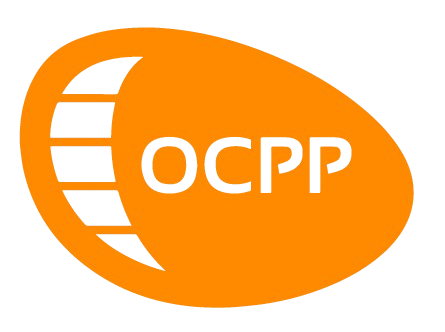

# OCPP Central System Implementation

## What is OCPP?

The Open Charge Point Protocol (OCPP) is an open-source protocol used for communication between Electric Vehicle Supply Equipment (EVSE) or charging station hardware and a central management system, known as the OCPP server. OCPP defines a set of standard commands and responses that enable communication between the charging station and the server.

## About this project

This project includes core commands for OCPP communication but not limited to:

- RemoteStartTransaction
- RemoteStopTransaction
- MeterValues
- StartTransaction
- StopTransaction
- TriggerMessage
- Reset
- ReserveNow
- CancelReservation
- ChangeConfiguration

## Technologies

- NodeJS
- RESTful API
- Web Socket Protocol
- OCPP Protocol
